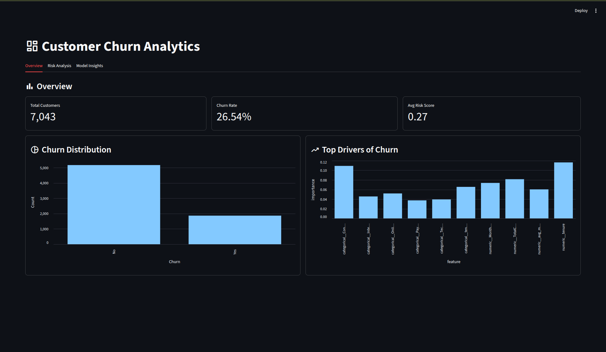
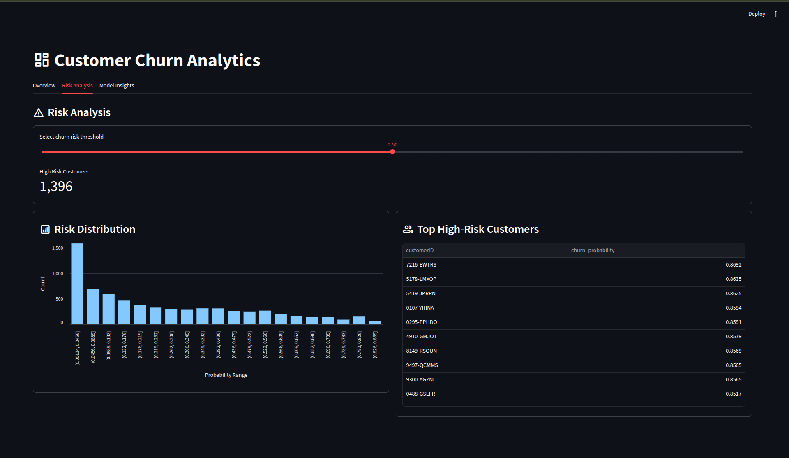
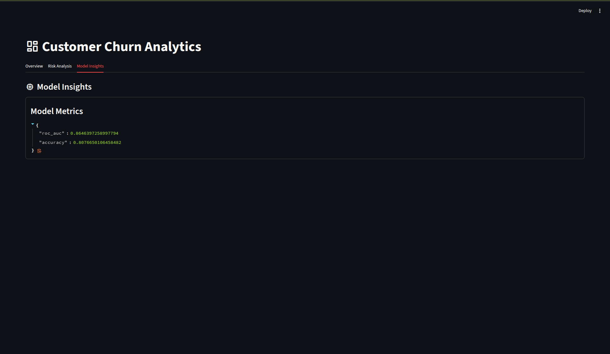

# 📊 ML-Powered Customer Analytics Dashboard

[](https://python.org)
[](https://streamlit.io)
[](https://mlflow.org)
[](https://scikit-learn.org/)

An end-to-end customer churn analytics project that combines data preparation, model training, experiment tracking, and an interactive dashboard for business decision-making.

This project is designed to help teams understand churn patterns, identify at-risk customers, and monitor model performance in a production-like workflow.

---

## 🎯 Business Value

The dashboard helps teams answer questions like:
- Which customers are most likely to churn?
- What factors contribute most to churn risk?
- How much revenue is exposed to churn risk?
- Which model performs best on the validation set?

---

## 🚀 Features

- **Data Pipeline:** Automated ingestion, validation, and feature engineering.
- **Model Training:** Training multiple machine learning algorithms (XGBoost, LightGBM, Random Forest, etc.).
- **Experiment Tracking:** MLflow integration for model comparison and selection based on ROC-AUC.
- **Interactive Dashboard:** Streamlit application providing business insights for churn risk monitoring.

---

## 📊 Dataset Summary

The project uses the **Telco Customer Churn** dataset.
- Total records: **7,043**
- Churn rate: **26.54%**
- Missing values: **0**
- Columns analyzed: **21**

---

## 🧠 Model Performance

The current best-performing model in the tracked MLflow experiment is a **Random Forest classifier**.
- **Best accuracy:** 80.77%
- **Best ROC-AUC:** 86.46%
- **Tracking:** MLflow
- **Selection Criteria:** Highest ROC-AUC

These values are based on the project’s saved MLflow runs in the current workspace.

---

## 🛠️ Tech Stack

- **Data Processing:** Python, Pandas
- **Machine Learning:** scikit-learn, XGBoost, LightGBM
- **Tracking & Deployment:** MLflow, Streamlit

---

## 📁 Project Structure

```text
ml-analytics-dashboard/
├── data/
│   ├── raw/
│   └── processed/
├── src/
│   ├── dashboard/
│   ├── ingestion/
│   ├── models/
│   ├── preprocessing/
│   ├── tracking/
│   └── utils/
├── tests/
├── notebooks/
├── mlruns/
├── requirements.txt
├── pyproject.toml
├── README.md
└── PROJECT_EXPLANATION.md
```

---

## 💻 Setup

1. **Create and activate a virtual environment:**
   ```bash
   python -m venv venv
   source venv/bin/activate
   ```

2. **Install dependencies:**
   ```bash
   pip install -r requirements.txt
   ```

---

## ⚙️ Train the Model

To train the baseline and comparison models, run:
```bash
python src/models/train.py
```
This logs the results to MLflow under the `Churn_prediction` experiment.

---

## 📈 Launch the Dashboard

Start the interactive Streamlit application:
```bash
streamlit run src/dashboard/app.py
```
Open the local URL shown in your terminal, typically: `http://localhost:8501`

---

## 🖼️ Screenshots

<div align="center">
  
  <br>
  <em>Dashboard Overview</em>
</div>
<br>

<div align="center">
  
  <br>
  <em>Churn Risk Insights</em>
</div>
<br>

<div align="center">
  
  <br>
  <em>Model Performance</em>
</div>

---

## 📝 Notes

- Model selection uses **ROC-AUC** as the primary optimization metric.
- **MLflow** provides experiment reproducibility and run comparison.
- The dashboard is built to be business-readable and suitable for presentation or stakeholder review.

---

## 📄 License

This project is intended for learning and portfolio/demo use.

